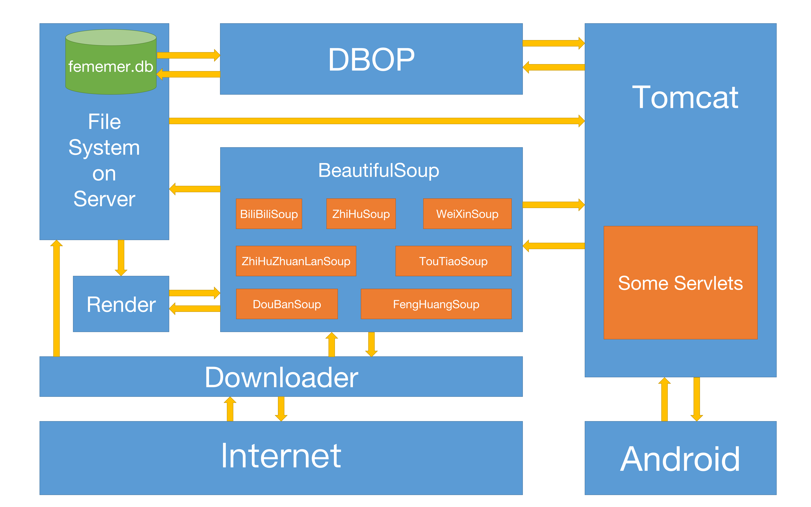

# FeMemer-with-Java

## 概述

### What's FeMemer

**FeMemer**（Forever Memory）是一个多应用收藏平台。平时我们在看到一些文章或者帖子的时候，可能会想到把它们收藏起来。但是如果这些帖子在不同的应用中，比如你又想看豆瓣的一个帖子，又想看知乎的一篇文章，又想查看微信公众号的一条推送。那你得同时打开这三个应用的收藏夹，我们这个应用就是基于这样一个场景，可以将不同app中的内容进行爬取并进行整合。同时，在将相关内容被爬取进你的FeMemer中以后，你不用像在原应用里边一样担心收藏的内容会被帖子作者删除，或者被下架。FeMemer将在云端永久保存你收藏的内容。这样，你在所有平台收藏的内容都将在本应用中展示并永久保存，解决了你切换多个应用苦苦查询相关信息的烦恼。

### 已实现的整合的（安卓客户端）平台

- [x] B站专栏
- [x] 豆瓣书评、乐评、影评等
- [x] 凤凰新闻
- [x] 今日头条
- [x] 微信公众号
- [x] 知乎回答
- [x] 知乎专栏
- [ ] 简书
- [ ] 网易新闻
- [ ] 新华社

### 组成

本项目由服务器端和客户端两部分组成。Android端主要负责收集用户请求、发送请求、展示爬取结果；服务器端负责处理客户端请求，将信息爬取并渲染后，存储在服务器上，以便客户端访问。

#### 客户端类图

### 环境配置

#### 客户端

Android 4.0.3以上（需使用网络权限）

#### 服务器端

- 操作系统：Linux（kernel 3.0以上）或macOS 10.14以上

- JDK 1.8以上

- Maven 3.0.5

- Tomcat 9

### 使用协议

- 在帮助用户找回密码方面，使用SMTP协议发送邮件到用户邮箱。

- 在客户端和服务器端通信方面，使用HTTP协议。

## 服务器端

### Servlets

本项目选用Tomcat作为处理网络请求的服务器。Servlets包中包含了一系列的servlet类。每个类对应一个url。服务器接收到客户端的请求后，根据不同的url，将网络请求发送给不同的servlet，相应的servlet将处理这些request并返回正确的response。

当遇到爬取文章请求时，Servlets将利用BeautifulSoup包爬取文章，并将爬取记录通过DBOP类写进femember.db数据库中。

当遇到普通的查询请求时，Servlets将直接利用DBOP读取fememer.db，返回查询结果。

### DBOP

DBOP包中包装了一系列数据库操作函数，用于完成所有与数据库相关的操作。

### BeautifulSoup

BeautifulSoup包包含了一系列爬取各类网站文章的类。它们从Downloader中获得网页源代码，对源代码进行解析后获取有用信息。之后，使用Render，套用项目自身的模板进行渲染，将渲染后的html文件和相应的资源文件存储在服务器的文件系统中。最后，向Servlets返回爬取结果的基本信息。

### Render

从BeautifulSoup中获取文章的基本内容后，使用本机的HTML模板进行渲染，渲染后的结果将返回给BeautifulSoup。

### Downloader

用于与Internet通信，获取网页源代码、下载图片等多媒体文件。

为了达到较好的爬取效果，这里使用了Chrome的headless模式进行网页源代码的获取。

## 客户端

本软件主要用java写成。

安卓端的难点技术在于发送邮件，文章列表页面布局，其他应用分享到此应用，以及从一段文字中抽取合法的URL。

- 找回密码发送邮件的功能我们使用了mail.jar等依赖包，在一个新线程中通过使用163邮箱的SMTP服务器来给用户发送邮件。在创建整个应用程序所需的环境信息的Session对象后获取邮件传输对象的Transport，之后根据传入的参数设置发件人的账户名和密码，发送邮件后关闭相关链接即发送完了邮件。

- 文件布局列表，使用了一个cardview控件，通过一个cardviewAdapter适配器来指定每一个item的点击事件和长按事件。适配器模式可以将某个类的接口转换成所需的相应类型，可以进行相应的统一管理。

- 其他应用分享到此应用，通过一个活动的过滤器，将此应用添加到安卓系统的分享列表中。若您在比如豆瓣app分享到FeMemer时，系统会自动截取分享文章页面的url进行自动爬取。

- 从文字中抽取合法的URL时，我们使用相关的正则表达式来找到输入文字中的相关URL。

- [okhttp](https://github.com/square/okhttp)，用于构建http请求。

- 

## 项目使用的第三方依赖

### 客户端

- 邮件发送模块：`activation.jar`,`additional.jar`,`mail.jar`用以实现找回密码发送邮件的功能。

- 消息显示美化：使用了`happy_bubble:1.1.4`，用来美化消息提示的气泡。

- 文章显示美化：使用了`cardview-v7:28.0.0-alpha3`进行文章卡片的显示。

### 服务器端

- Chrome浏览器及其驱动ChromeDriver。

- [selenium-java](https://www.seleniumhq.org/docs/03_webdriver.jsp)，用于驱动ChromeDriver。

- [Jsoup](https://jsoup.org/)，方便解析HTML文件。

- [sqlite-jdbc](https://github.com/xerial/sqlite-jdbc)，用于驱动sqlite数据库。

- [Freemarker](https://freemarker.apache.org/)，方便渲染HTML文件。

- 阿里的fastjason库，方便将要传输的对象转转换为json格式。

## LICENSE

MIT
