# FeMemer

## 产品说明

- 本产品是一款支持在线爬取、存储微信公众号、微博、豆瓣（影评、乐评）等文章和相关图片资源，并在线阅读、分类收藏的app。
  
- 本产品要求用户授予使用网络权限方可正常使用。
  
- 本产品安装包[下载链接](http://39.96.166.183:8080/fememer/FeMemer.apk)。

---

## 使用手册

### 登录界面

- 登录界面如上图所示，用户输入用户名和密码，验证正确后即可登录。
- 可以点击下方的忘记密码按钮，输入您绑定的邮箱号码，系统将发送邮件到您的邮箱中
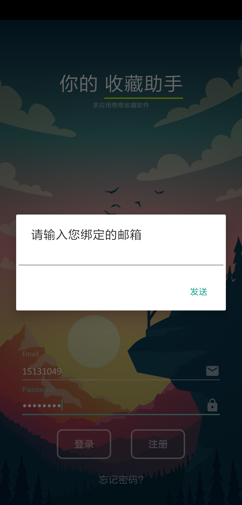
### 注册界面

- 注册界面可以注册账号，要求密码必须是8-20位数字或字母的组合，账户名必须是邮箱格式
- 如果说相关格式不符合需求，则会弹出一个遮罩层

### 主界面

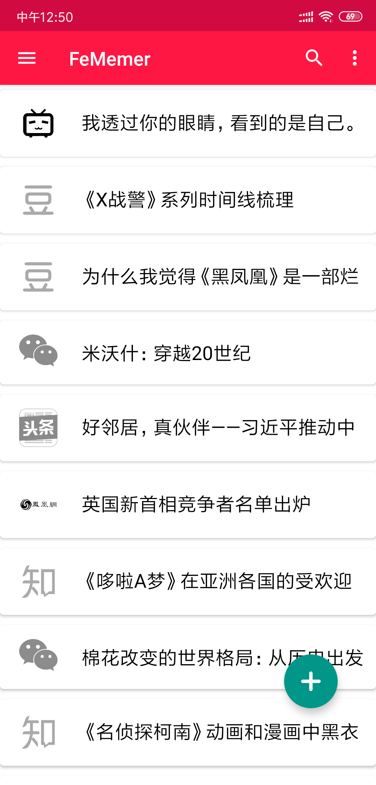

- 进入主界面后，程序将根据用户的登录信息连接服务器获取用户之前添加的文章信息，并按照时间顺序加载文章列表。该文章列表支持下拉刷新，效果如下图所示。
  

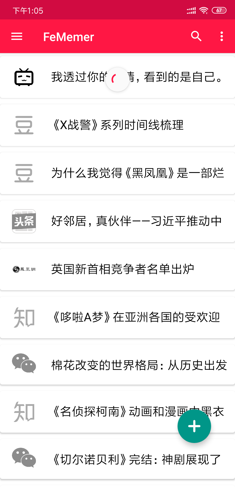

- 点击右上方的搜索按钮，用户在弹出的提示框输入若干关键字后可以对文章标题进行简单的筛选。效果如下图所示。
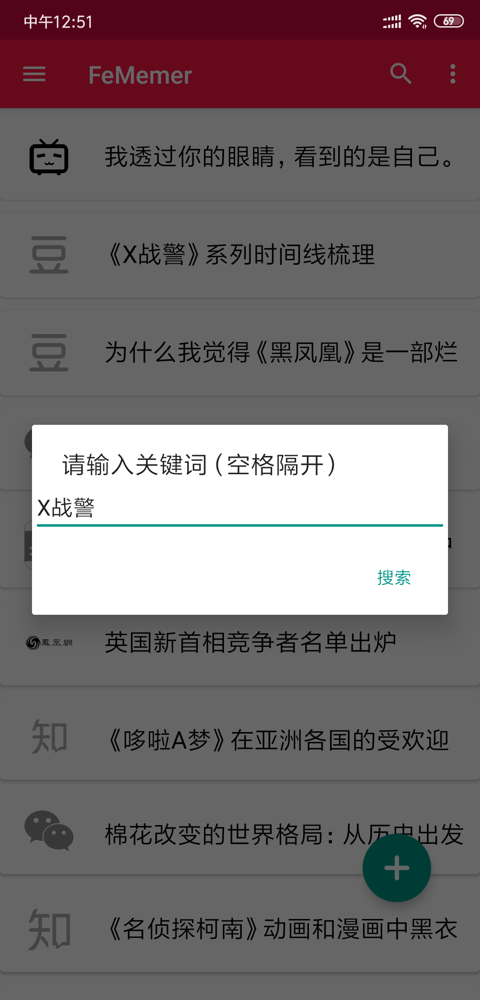
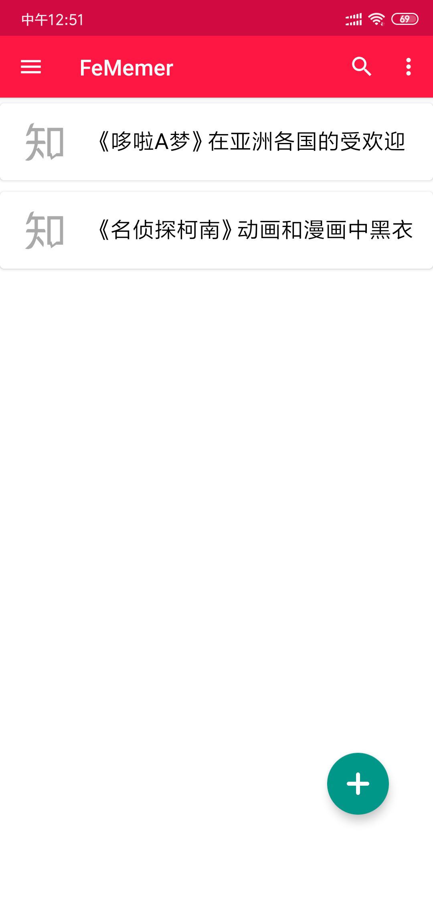
- 点击界面右上角的菜单键，在弹出的选项中可以选择对不同来源的文章进行筛选。效果如下图所示。
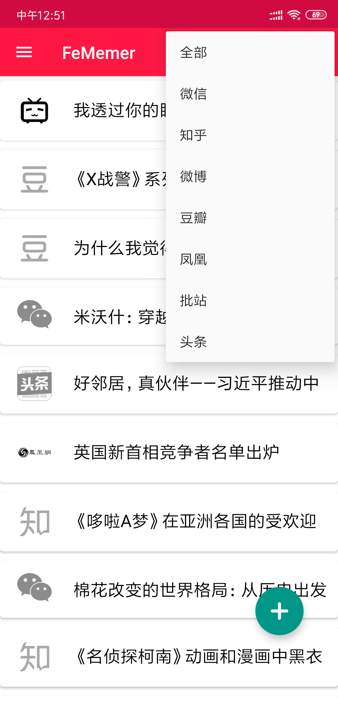

- 可以长按选择分享此文章或者删除此文章
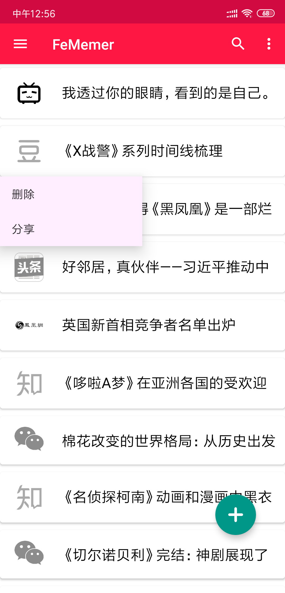
- 这里删除和分享操作的效果将在后边文章详细信息里谈，它们功能是一样的，这里只是为了方便
- 点击界面左上角导航菜单按钮或者左拉可以打开侧滑菜单，效果如下图所示。点击相应的菜单项即可进行相应的操作。

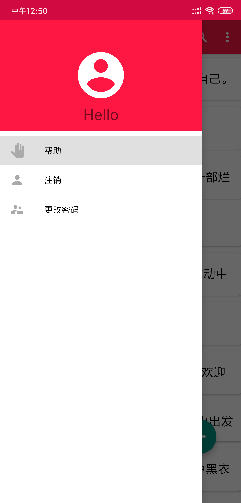

- 界面右下部的悬浮按钮用于跳转到添加页面，使用户可以添加新的文章链接。

### 添加界面

- 该界面要求用户输入要爬取存储文章的URL链接，应以http://或https://开头。用户确认后，服务器将根据链接爬取存储文章，爬取成功后，程序将跳转到刚刚爬取的位于服务器的网页。效果如下图所示。

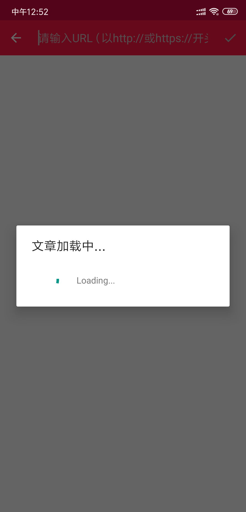

### 文章阅读界面

- 在主界面点击相应文章的标题或添加新的文章后，程序都会跳转至该页面。

- 在该页面，用户可以通过点击右上角的不同按钮分别实现更改或添加文分享和删除文章等功能。

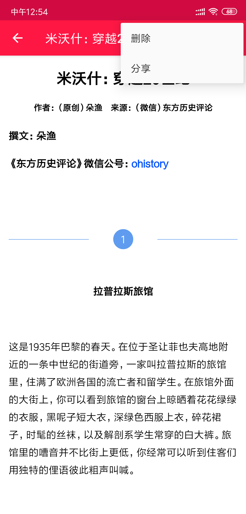

- 如果点击删除按钮，会将此文章删除并返回文章列表页面并自动更新列表
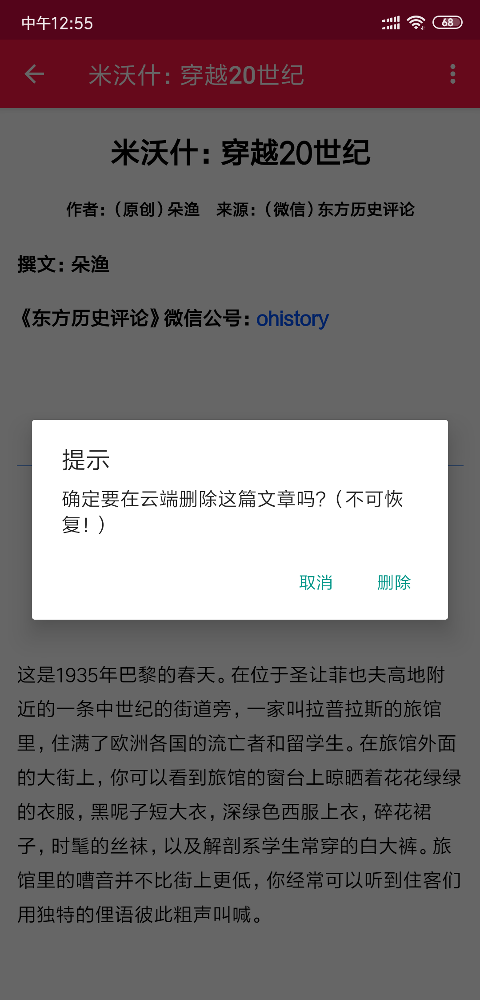
- 删除后效果如图所示

- 至于分享功能，我们可以从本APP向外部APP比如微信分享文章，也可以从外部APP分享到FeMemer中保存。
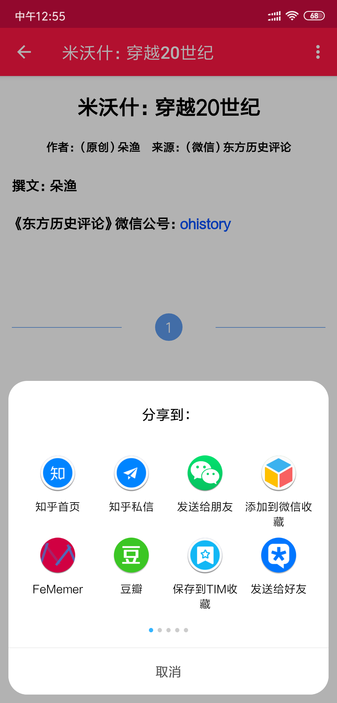
- 可以看到下图，系统的share列表中已经注册了FeMemer，将其分享到FeMemer中后系统将自动解析URL并爬取此URL的内容保存到云端显示给用户。
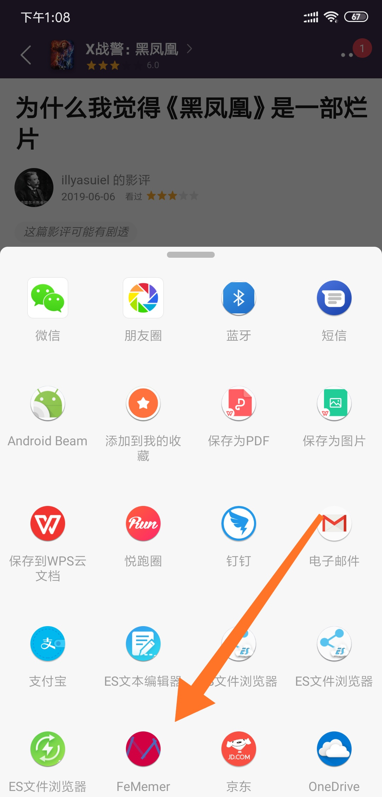

---

## 关于

- 本项目[主页](http://39.96.166.183:8080/fememer/)
- 本项目[GitHub地址](https://github.com/loheagn/FeMemer-with-Java)
- 联系我们：linan_123@buaa.edu.cn
